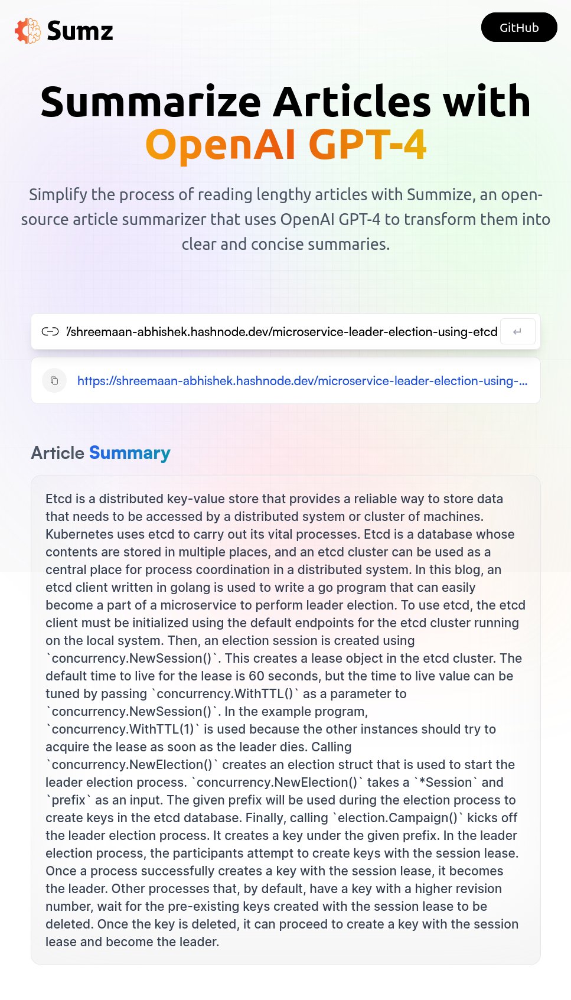

# Summarize Articles with OpenAI GPT-4

Simplify the process of reading lengthy articles with Summize, an open-source article summarizer that uses OpenAI GPT-4 to transform them into clear and concise summaries.



## Getting Started

To get started, clone this repository to your local machine:

```bash
  git clone https://github.com/csalam07/ai-blog-summerizer.git
```

Once you have cloned the repository, you can install the dependencies and start the development server:

```bash
  cd ai-blog-summerizer
  yarn
  yarn start
```

This will start the development server on http://localhost:5173

## Environment Variables

To run this project, you will need to sign up for a free test subscription at https://rapidapi.com/restyler/api/article-extractor-and-summarizer.

Once you have a test subscription, you can create a .env file in the root of the project, and set the following environment variables:

`VITE_RAPID_API_ARTICLE_KEY`=your_api_key_here

## Contributing

Contributions are always welcome!
Thank you ❤️
